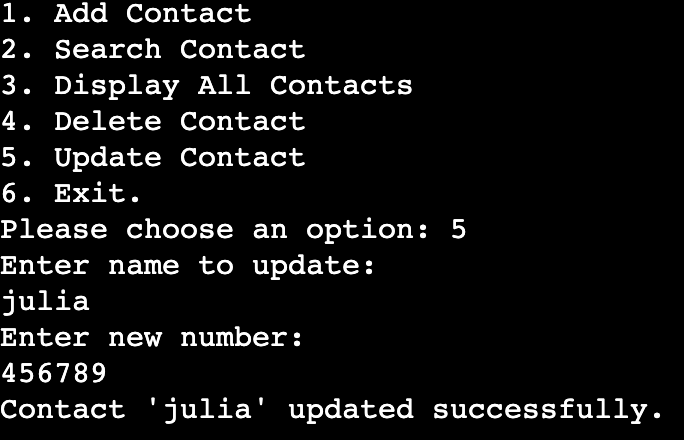

# Contact Book

Contact Book is a simple application that allows you to add, search, display, delete, and update contacts using Google Sheets as the backend storage. The application targets anyone needing a simple contact management tool.

[View application here](https://contact-book-volponi-6a8daca0e195.herokuapp.com/)

# Table of Content

  * [**User Experience**](<#user-experience>)
      * [User Stories](<#user-stories>)
      * [User Goals](<#user-goals>)
  * [**Design**](<#design>)
      * [FlowChart](<#flowchart>)
  * [**Features**](<#features>)
      * [Add Contact](<#add-contact>)
      * [Search Contact](<#search-contact>)
      * [Display All Contacts](<#display-all-contacts>)
      * [Delete Contact](<#delete-contact>)
      * [Update Contact](<#update-contact>)
      * [Data/APIs](<#dataapis>)
  * [**Features Left to Implement**](<#features-left-to-implement>)
  * [**Technologies Used**](<#technologies-used>)
  * [**Frameworks, Libraries & Software**](<#frameworks-libraries--software>)
  * [**Testing**](<#testing>)
      * [Lighthouse](<#lighthouse>)
  * [**Bugs**](<#bugs>)
  * [**Deployment**](<#deployment>)
      * [Deployment To Heroku](<#deployment-to-heroku>)
  * [**Credits**](<#credits>)
  * [**Acknowledgements**](<#acknowledgements>)

# User Experience

## User Stories

* As an user i want to store my personal contacts in an organized manner so that I can easily retrieve and manage them.

  * I can add new contacts with name and number.

  * I can search for contacts by name.

  * I can view all my contacts.

  * I can delete contacts.

  * I can update contact information.

  ## User Goals

  * As a user of the application, I want to manage my contacts by easily adding, searching, displaying, deleting, and updating contact information, while ensuring that my data is stored securely. 

  # Design

  ## Flowchart

  The flowchart for this application was made with the website [Diagrams App](https://app.diagrams.net/)

# Features

 ## Existing Features

### Add Contact:

* Enter a new contact with name and number.
* Automatically store the contact in both original and lowercase formats for case-insensitive search.

### Search Contact:

* Search for contacts by name, supporting case-insensitive searches.

### Display All Contacts:

* List all stored contacts with their names and numbers.

### Delete Contact:

* Search for contacts by name and display results.
* Provide an option to confirm before deleting the contact.

### Update Contact:

* Search for contacts by name and display matching results.
* Allow the selection of a contact to update its number.
* Replace the old number with the new one, ensuring no duplication.

### Data/APIs:
* Securely store contact information in Google Sheets.

## Features Left to Implement

 * Add possibility of updating also names.
 * Add more intelligent searching for choosing which contact if contains the same first name to update or delete.

 # Technologies Used

 ## Languages
 * [Python](https://en.wikipedia.org/wiki/Python_(programming_language)) - Provides the functionality for the application.

 ## Frameworks, Libraries & Software
 * [Google Sheets](https://www.google.co.uk/sheets/about/) - Used to host the application data.
 * [Github](https://github.com/) - Used to host and edit the website.
 * [Gitpod](https://www.gitpod.io/) - Used to code entire application.
 * [Heroku](https://en.wikipedia.org/wiki/Heroku) - A cloud platform that the application is deployed to.
 * [Responsive Design Checker](https://www.responsivedesignchecker.com/) - Used for responsiveness check.

 # Testing

 ## PEP Validation

 No erros were returned when passing through the PEP validator.

 

 ## LightHouse

 Google Lighthouse in Chrome Developer Tools was used to test the application within the areas of Performance, Accessibility, Best Practices and SEO. The testing showed these results: Accessability: 94, Best Practices: 100, SEO: 91, Performance: 94. 

## Bugs

* Bug: During the mid project session with my mentor Precious he found a bug in the add contact function. It was possible for the user to input empty strings. This generated a problem when listing the table due to empty lines.

* Bug: Contacts weren't case-insensitive. Which could cause problems if user tried to search for contact with uppercase or otherwise.

# Deployment

## Deployment To Heroku 

The project was deployed to [Heroku](https://www.heroku.com). To deploy, please follow the process below:

1. The first step is to log in to Heroku (or create an account if needed).

2. In the top right corner there is a button that is labeled 'New'. Click that and then select 'Create new app'.

3. Now it's time to enter an application name that needs to be unique. When you have chose the name, choose your region and click 'Create app".

4. On the next page, click the 'Settings' tab and find the "Config Vars" section. Click "Reveal Config Vars". Now it's time to add values. In the 'WOM Record Collection' case I needed to add two values. The first one was the credentials (KEY input field = "CREDS", VALUE input field = "your credentials", click the 'Add' button. Next you need to add another key, enter "PORT" in the KEY input field and "8000" in the VALUE field), click the 'Add' button.

5. Scroll down to the buildpacks section on the settings page and click the button 'Add buildpack'.

6. Add "Python" and node.js". It is important that Python is listed above node.js.

7. Scroll to the top of the settings page and click the 'Deploy' tab. For deployment method, select 'Github'. Search for the repository name you want to deploy and then click connect.

8. Scroll down on the deploy page and choose deployment type. Choose to enable automatic deployments if you want to and then  click 'Deploy Branch'.

# Credits

* Template for read.me provided by Code Institute (with some ideas that my mentor Precious Ijege showed me).

# Acknowledgements

The application Contacts Book was completed as my third Portfolio Project (Python) for the Full Stack Software Development Diploma at the Code Institute. I would like to thank Code Institute for such good teaching, Marko for always checking up and offering advices/help when needed, and specially to my mentor Precious Ijege for always guiding me, giving me ideas and pointing improvements.

